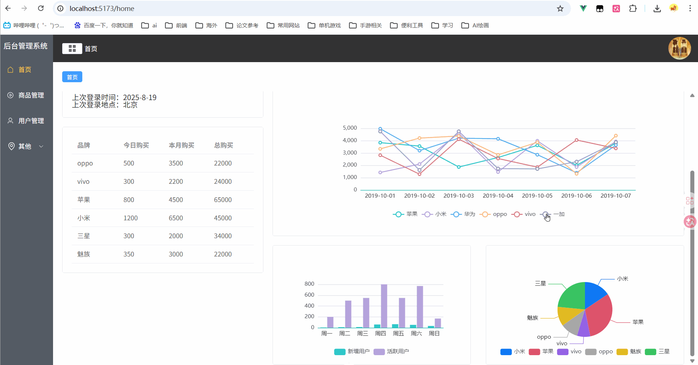
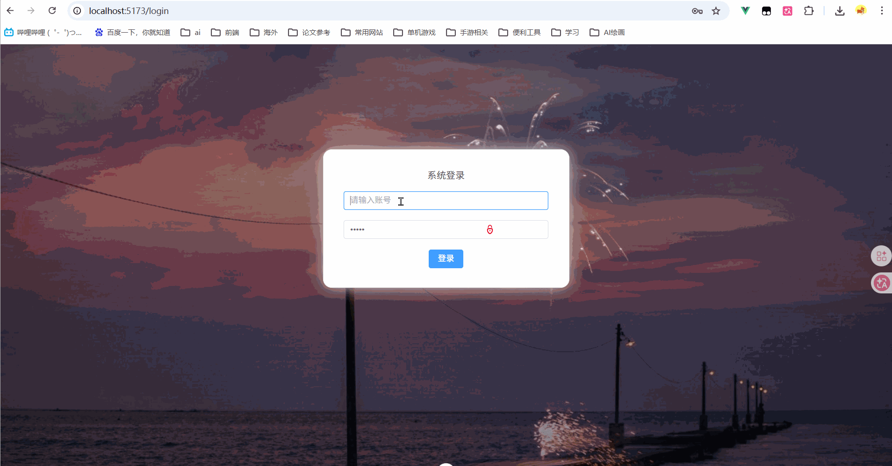
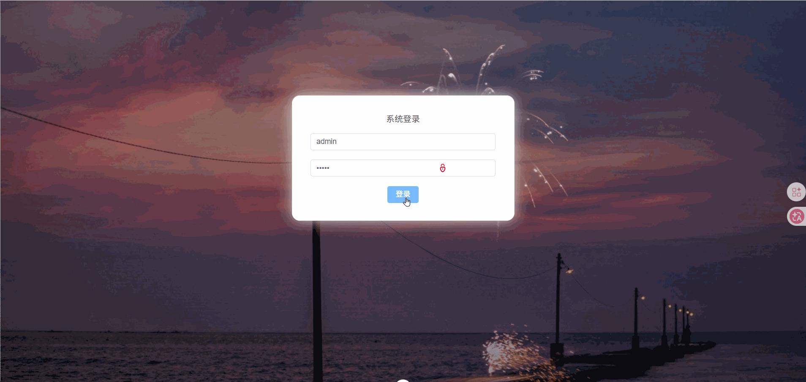

Vue3 后台管理系统模板DEMO
这是一个基于 Vue 3 + TypeScript + Pinia + Element Plus 构建的现代化后台管理系统模板。项目集成了动态路由、权限控制、标签页导航、数据可视化等常用功能，并采用 Mock.js 模拟后端数据，方便快速启动和二次开发。

技术栈
核心框架：Vue 3 + TypeScript

构建工具：Vite

状态管理：Pinia

路由管理：Vue Router 4

UI 组件库：Element Plus

图表库：ECharts

HTTP 客户端：Axios

数据模拟：Mock.js

CSS 预处理器：Less

主要功能
登录/权限：基于 token 的登录认证，不同账号返回不同的菜单权限（示例账号：admin/admin，xiaoxiao/xiaoxiao）。

动态菜单：登录后根据接口返回的菜单数据动态生成侧边栏。

标签页导航：支持多标签页操作，可关闭除首页外的标签。

首页仪表盘：

用户信息卡片

品牌销售数据表格

ECharts 图表（折线图、柱状图、饼图）

用户管理：支持用户列表的增删改查、分页、按姓名搜索。

商品管理：占位页面，可自行扩展。

其他页面：页面1、页面2（用于展示多级菜单）。

目录结构
text
├── public                # 静态资源

├── src

│   ├── api               # API 接口和 Mock 配置

│   │   ├── api.js        # API 统一出口

│   │   ├── mock.js       # Mock 拦截配置

│   │   ├── mockData      # Mock 数据

│   │   └── requst.js     # Axios 请求封装

│   ├── assets            # 图片等静态资源

│   ├── components        # 公共组件

│   │   ├── Left.vue      # 侧边栏菜单

│   │   ├── Tap.vue       # 标签页

│   │   └── Top.vue       # 顶部栏

│   ├── router            # 路由配置

│   │   └── index.js

│   ├── stores            # Pinia 状态管理

│   │   └── index.ts

│   ├── views             # 页面视图

│   │   ├── HomeView.vue  # 首页

│   │   ├── UserView.vue  # 用户管理

│   │   ├── MallView.vue  # 商品管理

│   │   ├── Page1.vue     # 页面1

│   │   ├── Page2.vue     # 页面2

│   │   ├── IndexView.vue # 主布局

│   │   └── LoginView.vue # 登录页

│   ├── App.vue

│   └── main.ts

├── .gitignore

├── index.html

├── package.json

├── README.md

└── vite.config.ts

使用说明
登录
管理员账号：admin / admin → 拥有所有菜单权限

普通用户账号：xiaoxiao / xiaoxiao → 仅拥有首页和用户管理菜单

登录后 token 和菜单数据会保存到 localStorage，刷新页面自动恢复登录状态。

标签页操作
单击标签页可切换路由。

非首页标签支持关闭（点击标签右侧的 × 图标）。

用户管理
搜索：在输入框中输入姓名，点击查询按钮即可过滤列表。

新增：点击“添加”按钮，填写表单后提交。

编辑：点击表格中的“编辑”按钮，修改信息后提交。

删除：点击“删除”按钮，二次确认后删除。

项目预览

主要页面展示(./git_imgs/主要页面展示.gif)

